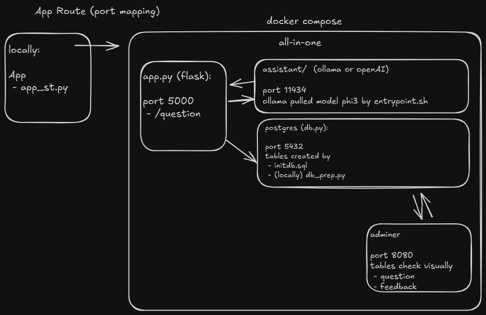
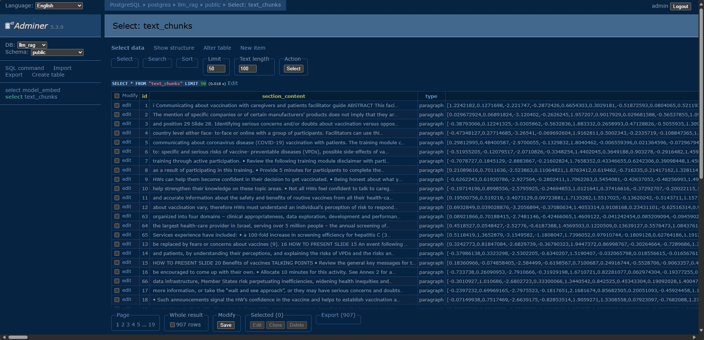
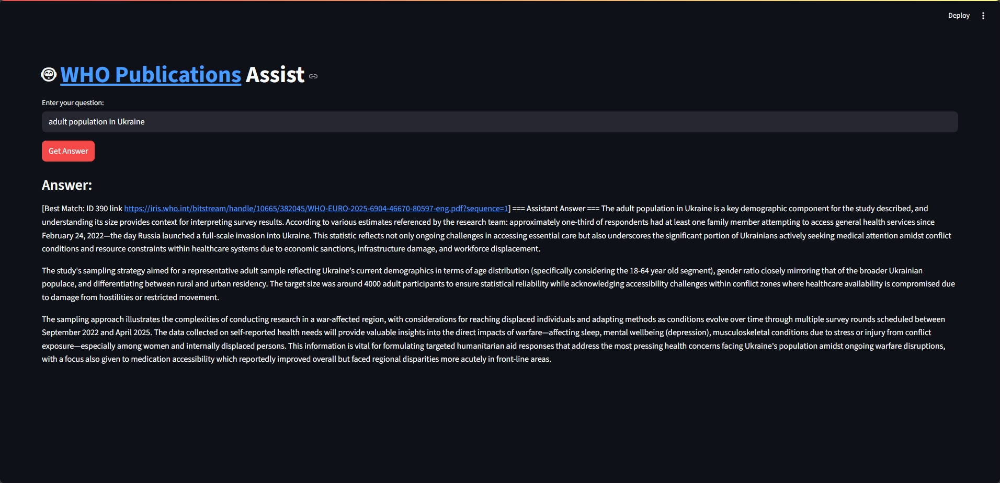

# 📚 LLM RAG [WHO Publications](https://www.who.int/europe/publications/i) Assistant Project 

A Retrieval-Augmented Generation (RAG) pipeline for working with reports (like [WHO](https://www.who.int/europe/publications/i) publications).

Many reports are released as PDFs. While this format is easy for people to read, it’s hard to analyze automatically or quickly extract specific information—especially when dealing with a large collection of files and no clear way to search through them.

It downloads PDFs, chunks them, stores vectors in Postgres (with pgvector), and lets you ask questions with an LLM that uses context retrieved from the database.


## 🚀 Why this project?

PDFs are great for humans but hard to search programmatically. If you have hundreds of reports, finding one number or insight is painful.

This project:
* Docker and Docker Compose
* Fetches reports (via scraping or manual links)
* Breaks them into structured chunks
* An API key from OpenAI 
* Embeds them (OpenAI or Ollama)
* Stores in Postgres + pgvector (time (approx 30-90 Minutes) depening on your system)
* Lets you query using cosine, Euclidean (FAISS), dot-product, or Canberra distance
* Combines results to give the best chunk as LLM context


## 🗂️ Project Structure

```sh
assistant/
│── __init__.py
│── config.py         # Env vars, constants, provider selection
│── scraper.py        # Fetch links (Selenium optional), download PDFs
│── text_processing.py# Clean, chunk, hash
│── embeddings.py     # OpenAI/Ollama embedding + chat clients
│── db.py             # Postgres: schema, upsert, pgvector queries
│── search.py         # pgvector + FAISS + Canberra search
│── pipeline.py       # End-to-end ingestion pipeline
│── cli.py            # Command-line interface
```


## 🛠️ Requirements

* Docker & Docker Compose
* Postgres ≥ 15 with pgvector extension
* API key (only if using OpenAI)

Optional:
* Ollama (local embedding + chat models)
* Selenium + Chrome (if scraping dynamic WHO pages)


## ⚡How to install?
* Clone this repository
    ```sh
    git clone https://github.com/celik-muhammed/LLM-RAG-WHO-Publications-Assistant.git
    cd llm-rag-assistant
    ```
* Make sure you fulfill the requirements from above
* Environment variables: Change in `docker-compose.yml` or Create a file `.env` and add the following: `OPENAI_API_KEY=your_key`
* Store `.env` at the root of the repository (the same place where you see all the other files)
    ```sh
    LLM_PROVIDER=OPENAI    # or OLLAMA
    OPENAI_API_KEY=sk-xxx  # only if using OpenAI
    ```
* Execute `make all` to build the docker images and start docker compose. Pay attention, depending on your settings you must adjust the makefile and add simply `sudo` before each command. If you don't have `make` installed and don't want to install it, move on with the commands within the `Makefile`. You can open it with any text editor.
    ```sh
    make all
    ```
* Currently, data is fetched and ingested into the database. This will take some time (approx 30-60 Minutes) depening on your system. 
<!-- * If you want to re-run it later, make sure to change in the file `load = yes` to `load = no`. Then the download process will be skipped. You'll not ingest the data twice, if you don't do that, but it still needs the same amount of time. -->
* Within the same file you'll see `DEFAULT_MAX_PAGES = 1`, which simply means the first page and all reports from there are fetched. You can add more pages, but be aware this will need a lot of time and during the development the web site of the WHO doesn't react from time to time.
* If you want to re-run, simply execute `make rag`
    ```sh
    docker-compose up -d
    ```
* Install Python deps
    ```sh
    pip install -r requirements.txt
    ```

<p align="center">  </p>

## 🔄 Workflow

```sh
[ Scraper ] → [ PDF Downloader ] → [ Text Chunker ] → [ Embedder ]
       ↓                                   ↓
     Links                              Vectors
       ↓                                   ↓
   Postgres + pgvector   ←── store ──→   Metadata
       ↓
   [ Search (cosine, faiss, dot, canberra) ]
       ↓
   [ RAG → LLM (OpenAI or Ollama) ]
```

<p align="center">  </p>

## ▶️ Usage (optionally check [notebook.ipynb](notebook.ipynb))

Ingest WHO reports

```sh
# fetch who pdfs push embeddings to db (~90 min depends on host)
# re-try if Totally fetched/scraped 0 .pdf links!, then check db by adminer
python assistant/pipeline.py
```

Ask questions

```sh
# Ask questions (ollama ~11 min)
python assistant/cli.py ask -q "adult population in Ukraine"
```

UI Streamlit

```sh
# Ask questions
streamlit run app_st.py
```

<p align="center">  </p>

## 🏗️ Architecture Diagram

```sh
         ┌─────────────┐
         │   Scraper   │── fetch WHO links
         └──────┬──────┘
                │
         ┌──────▼──────┐
         │   PDFs      │── download & parse
         └──────┬──────┘
                │
         ┌──────▼──────┐
         │ Chunker     │── split into sections
         └──────┬──────┘
                │
         ┌──────▼──────┐
         │ Embeddings  │── (OpenAI or Ollama)
         └──────┬──────┘
                │
         ┌──────▼──────┐
         │ Postgres +  │── store vectors + metadata
         │   pgvector  │
         └──────┬──────┘
                │
         ┌──────▼──────┐
         │   Search    │── cosine / FAISS / Canberra
         └──────┬──────┘
                │
         ┌──────▼──────┐
         │    LLM      │── answer with best context
         └─────────────┘
```

## 🔎 How does it work?

The workflow follows these steps:
1. **Environment setup**: Everything runs inside Docker to ensure all dependencies are consistent.
2. **Database initialization**: A Postgres (v17) instance with the pgvector extension is started.
3. **Scraping WHO publications**: Chrome (via Selenium) is used to navigate the WHO site. Since new reports load dynamically without changing the URL, JavaScript interaction is required to move between pages.
4. **Collecting links**: All report links are stored in a Python set, ensuring each file is only downloaded once.
5. **Downloading PDFs**: Each collected URL is fetched and saved locally.
6. **Chunking text**:
   - PDFs are split into smaller, meaningful chunks.
   - Lengths are variable, not fixed.
   - Headers and bullet points are identified with regex.
   - Long paragraphs are further split with slight overlaps (using nltk or re).
7. **Embedding & database storage**:
   Each chunk is vectorized and stored in Postgres with metadata:
    1. id: auto-generated identifier
    2. section_content: chunk text
    3. type: header or paragraph
    4. vector: embedding (Ollama’s `nomic-embed-text` OpenAI’s `text-embedding-3-small`)
    5. hash: prevents duplicate storage
    6. group_id: groups chunks from the same file
    7. timestamp: time of insertion
8. **User query**: The user’s question is embedded with the same model.
9. **Similarity search**:
   The query vector is compared to stored vectors using four methods:
    1. Cosine Similarity
    2. Euclidean Distance by using FAISS (Facebook AI Similarity Search)
    3. Dot product also by FAISS
    4. Canberra Distance
10. **Result ranking**: Top 5 results from each method are scored (5 points for rank 1, 4 for rank 2, …). The combined top 3 chunks are selected.
11. **Contextual answer generation**: The best chunk is passed as context, along with the user’s question, to (Ollama’s `phi3` OpenAI’s `gpt-4o`).
12. **Response loop**: The model generates a detailed answer. The user can then exit or continue asking more questions.

## ⚠️ Limitations

* Current scraping logic is tuned for WHO site (adjust selectors for other domains).
* LLM may answer even without strong evidence in the DB (hallucinations possible).
* Processing many PDFs takes time (30–60 min+ depending on system).

## 🔮 Roadmap
There are many improvments which could be implemented:
1. Set up an Web UI (FastAPI + React)
2. Set up some Monitoring (Prometheus + Grafana)
3. Multi-source ingestion (WHO, CDC, custom docs)
4. Using linters
5. Store Q&A logs for fine-tuning (user's questions and the corresponding answers in a database, for reuse)
6. More distance metrics & hybrid search and Clean the script

There are many more possible improvements. I may add and refine features over time, but for now the project represents a first working version developed under limited time.
